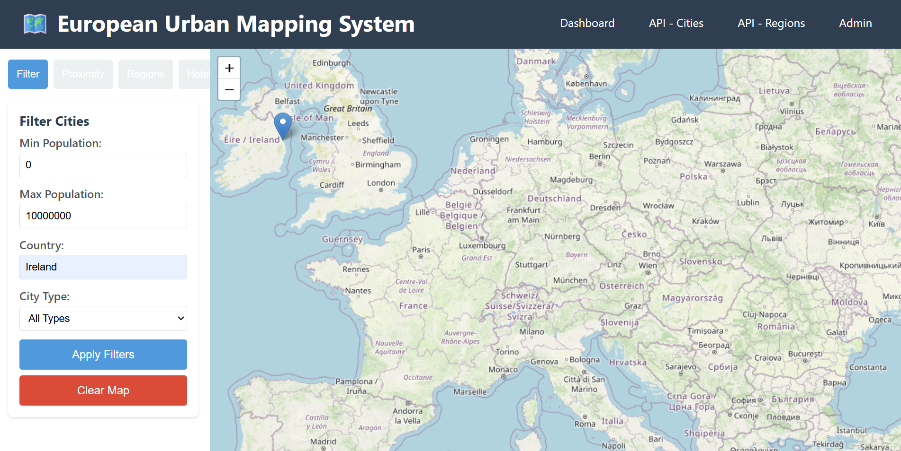
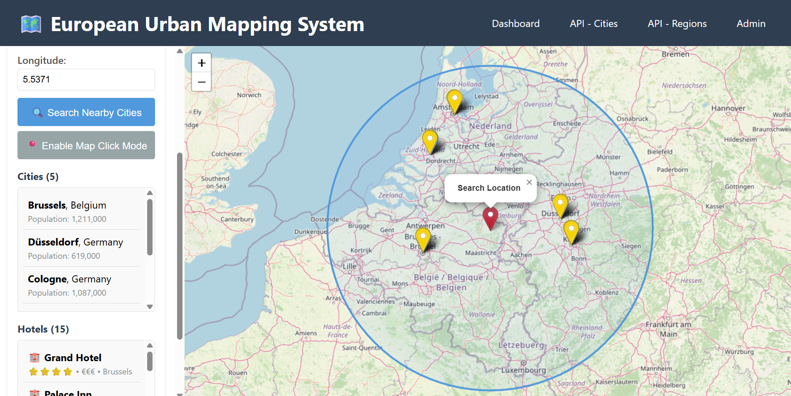
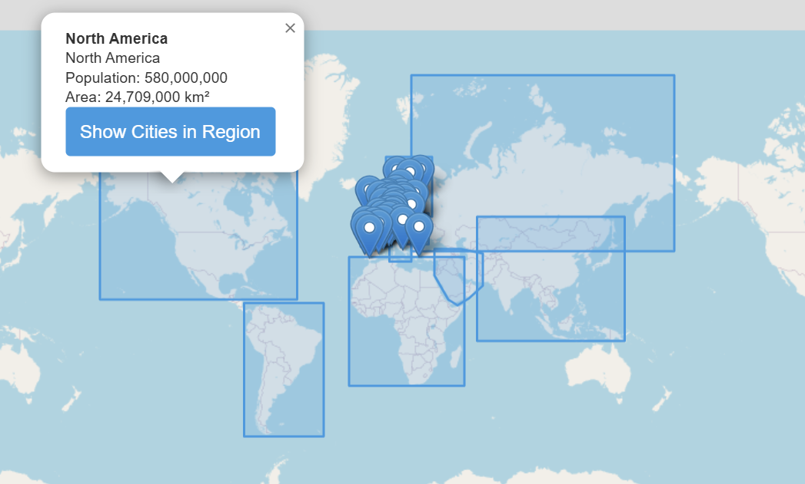
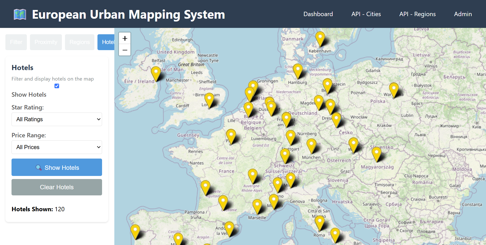
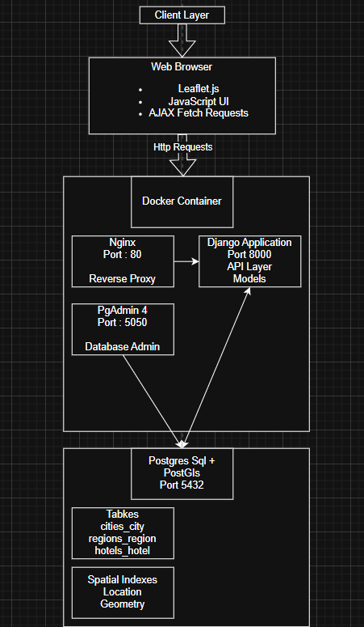

# European Urban Mapping System

A location-based services (LBS) application for exploring cities, regions, and hotels across Europe and beyond. Built with Django, PostGIS, and Leaflet for interactive spatial data visualization.

## Overview

This web mapping application provides interactive tools for discovering urban locations through spatial queries. Users can search for cities by population, find nearby hotels, visualize regional boundaries, and perform proximity searches—all through an intuitive map interface.

**Key Stats**: 40 cities • 12 regions • 120 hotels • 4 spatial query types

## Features

- **Proximity Search** - Click any map location to find cities and hotels within a custom radius
- **Region Visualization** - Display continental boundaries covering Europe, Asia, Middle East, Americas, and Africa
- **Hotel Finder** - Filter accommodations by star rating (1-5) and price range (budget/moderate/luxury)
- **City Filtering** - Search by population, country, and city type
- **Interactive Map** - Leaflet-based interface with color-coded markers (blue=cities, gold=hotels)
- **RESTful API** - GeoJSON endpoints for programmatic access

## Screenshots

### Main Dashboard - Filter View

*Interactive map interface showing European cities with population and country filters. The sidebar provides filtering options while the Leaflet map displays city markers across the continent.*

### Proximity Search

*200km radius search centered near the Baltic Sea coast, showing 1 nearby city (Berlin) and 3 hotels. The blue circle visualizes the search area, with results listed in the sidebar including distance and attributes.*

### Regional Boundaries

*Interactive region visualization showing continental boundaries across the globe. Clicking a region (Central Europe shown) displays population and area statistics with the ability to query all cities within that region's polygon boundaries.*

### Hotel Search and Filtering

*Hotel search interface displaying 120 accommodations across Europe (gold markers). Users can filter by star rating (1-5) and price range (budget/moderate/luxury) to find suitable lodging options.*

## System Architecture


*Complete system architecture showing the three-tier structure with Docker containerization, component interactions, and data flow between client, application, and database layers.*

## Tech Stack

**Backend**: Django 5.2 • PostgreSQL 17 • PostGIS 3.5 • Django REST Framework  
**Frontend**: Leaflet.js • OpenStreetMap • Vanilla JavaScript  
**Deployment**: Docker Compose • Nginx • PgAdmin  
**Geospatial**: GDAL • GEOS • PROJ

## Quick Start with Docker

**Prerequisites**: Docker Desktop installed and running

**Run the application**:
```bash
cd european_mapping
docker-compose up -d
```

**Access**:
- Dashboard: http://localhost
- API: http://localhost/api/cities/
- Admin: http://localhost/admin/
- PgAdmin: http://localhost:5050 (Email: pierce@pierce.com, Password: pierce)

**Stop**:
```bash
docker-compose down
```

## Local Development Setup

For running without Docker:

1. **Install PostgreSQL with PostGIS**

2. **Create Python environment**:
```bash
conda create -n geo python=3.11 -y
conda activate geo
conda install -c conda-forge gdal proj geos psycopg2 -y
pip install -r requirements.txt
```

3. **Create database**:
```bash
psql -U postgres
CREATE DATABASE european_mapping_db;
\c european_mapping_db
CREATE EXTENSION postgis;
\q
```

4. **Configure settings** - Update database credentials in `european_mapping/settings.py`

5. **Run migrations**:
```bash
python manage.py migrate
python manage.py createsuperuser
```

6. **Start server**:
```bash
python manage.py runserver
```

Visit http://127.0.0.1:8000

## Using the Application

The dashboard features four tabs for different spatial analysis tools. See screenshots above for visual examples.

### Filter Tab (Dashboard Screenshot)
- Filter cities by population range, country, or city type
- Blue markers show filtered city locations
- Click "Apply Filters" to update the map

### Proximity Tab (Proximity Search Screenshot)
- Enable map click mode to select a search location
- Click map to place red search marker
- Set search radius in kilometers
- Results show nearby cities and hotels in scrollable lists
- Blue circle visualizes search area

### Regions Tab (Regional Boundaries Screenshot)
- Toggle 12 regional boundaries on/off
- Click any region polygon for statistics
- Shows population, area, and city count
- "Show Cities in Region" performs containment query

### Hotels Tab (Hotel Search Screenshot)
- Filter 120 hotels by star rating (1-5) or price range
- Gold markers distinguish hotels from cities
- Displays Grand Hotel, Palace Inn, and City Lodge locations
- Popup shows amenities and pricing

## API Endpoints

All endpoints return GeoJSON FeatureCollections.

**Cities**:
```
GET /api/cities/
GET /api/cities/?population_min=500000
GET /api/cities/?country=France
GET /api/cities/nearby/?lat=48.8566&lng=2.3522&distance=50
```

**Regions**:
```
GET /api/regions/
GET /api/regions/{id}/cities/
```

**Hotels**:
```
GET /api/hotels/
GET /api/hotels/?star_rating=5&price_range=luxury
GET /api/hotels/nearby/?lat=48.8566&lng=2.3522&radius=50
```

## Spatial Queries Implemented

1. **Distance-Based Query**: Find cities/hotels within X kilometers of a point using PostGIS `ST_Distance`
2. **Containment Query**: Find cities within region boundaries using PostGIS `ST_Within`
3. **Hotel Proximity**: Distance-based search with attribute filtering (stars, price)
4. **Attribute Filtering**: Combine spatial and non-spatial criteria (population + distance)

All spatial columns use GIST indexes for performance.

## Project Structure


european_mapping/
├── api/              # REST API (serializers, views, URLs)
├── cities/           # City model and data
├── regions/          # Region model and boundaries
├── hotels/           # Hotel model and POI data
├── dashboard/        # Frontend templates and UI
├── european_mapping/ # Django settings
├── docker-compose.yml
├── Dockerfile
├── nginx.conf
└── requirements.txt


## Database Models

**City**: Point geometries with population, GDP, unemployment data  
**Region**: MultiPolygon boundaries with auto-calculated area and centroid  
**Hotel**: Point locations with star ratings, price categories, and amenities

All models use EPSG:4326 (WGS 84) coordinate system.

## Docker Architecture

The application runs in 4 containers on a custom network:
- **Django** (port 8000): Application server
- **PostgreSQL** (port 5432): Database with PostGIS
- **Nginx** (port 80): Reverse proxy
- **PgAdmin** (port 5050): Database admin interface

Named volumes ensure data persistence across container restarts.

## Troubleshooting

**Containers won't start**: Ensure Docker Desktop is running and ports 80/5432/5050/8000 are available

**Map not loading**: Check browser console for errors, verify API endpoints return data

**Database errors**: Confirm PostgreSQL is running and credentials match settings.py

## Known Limitations

- No user authentication system
- Read-only public API (CRUD via admin only)
- Static dataset (no live data feeds)
- Fixed to WGS 84 coordinate system
- Optimized for modern browsers only

## Credits


**Technologies**: Django • PostGIS • Leaflet.js • OpenStreetMap • Docker


